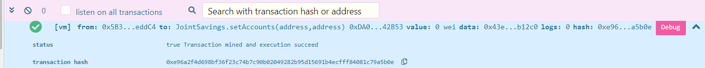
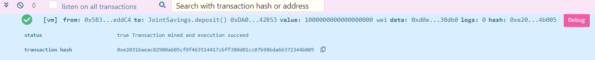
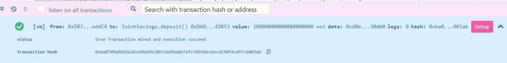
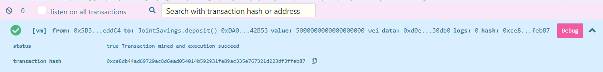
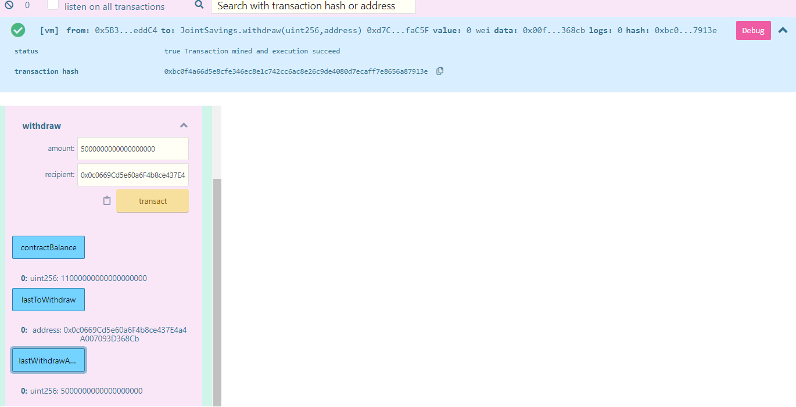
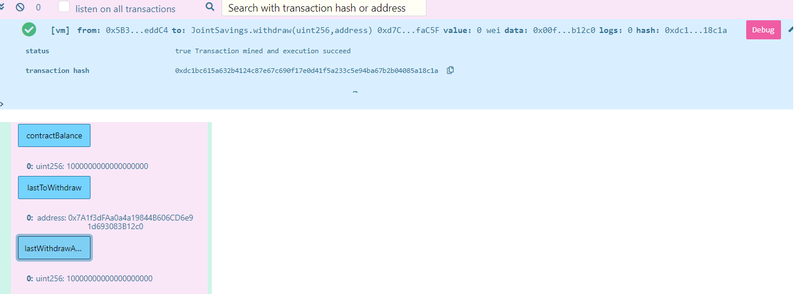

# Solidity_Smart_Contract

This smart contract hosts join saving accounts and consists of ability to deposit and withdraw funds from the account.

## Technologies

* [Remix IDE](https://remix.ethereum.org/#optimize=false&runs=200&evmVersion=null) - For building and testing smart contracts that you create with Solidity.

## Usage

To use the smart contract for join saving account management, simply clone all the files from this repository and open **joint_savings.sol** on remix IDE website.

Below are screenshots of smart contract activities.

Set Accounts

Sending 1 ETH as WEI

Sending 10 ETH as WEI

Sending 5 ETH

Withdraw 5 ETH

Withdraw 10 ETH

## Contributors

Brought to you by FinTech Material and Eunice

---

## License

MIT